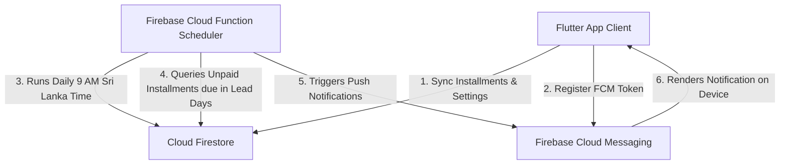

# 📱 Multi-Provider Installment Calculator

A premium, dark-themed utility application built using Flutter to help users calculate payment schedules, processing fees, and installment amounts across multiple popular Buy Now Pay Later (BNPL) services in Sri Lanka.

---

## ✨ Features

### 🏠 Smart Dashboard
*   **Activity Overview**: See at-a-glance stats — total calculations, comparisons made, and a breakdown of your most-used provider.
*   **Recent History**: A unified feed of your last calculations across all providers, so you never lose track.
*   **Quick Actions**: Jump straight into any calculator, comparison tool, or shopping guide from the home screen.

### 💳 BNPL Calculators (All Providers in One Place)
Access all three provider calculators from a single organized hub.

#### 🥥 Koko
*   **Installment Planner**: Quick calculation of 3-month installment plans.
*   **Find Shop Fee Tab**: Calculate the hidden processing fee percentage charged by specific shops.
    *   Input the raw item value and the final price shown on the shop's site to calculate the precise additional fee.
    *   Highlights the default 6% secondary rate charged directly by Koko.
    *   Reminders to verify whether delivery or extra costs are included.

#### ⚡ PayZy
*   **Flexible Terms**: Calculate payments for 2, 3, or 4-month schedules.
*   **Customizable Fee**: Adjust the processing fee percentage (defaults to 8%) to see updated payment details instantly.

#### 🍃 MintPay
*   **3-Month Plans**: Calculate 3-month installment schedules.
*   **Customizable Fee**: Edit and apply specific installment/processing fees (defaults to 0%) for MintPay partners.

---

### ⚖️ Provider Comparison Tool
*   **Side-by-Side Comparison**: Enter a single purchase amount and instantly compare the total cost, monthly payment, and fees across Koko, PayZy, and MintPay.
*   **Custom Fee Overrides**: Adjust individual provider fees before comparing to reflect real shop-specific rates.
*   **Cheapest Option Highlight**: The app automatically flags which provider costs the least for your specific purchase.

---

### 🛒 BNPL Shopping Guide
*   **How BNPL Works**: A clear, beginner-friendly explanation of the buy-now-pay-later model.
*   **Provider-Specific Tips**: Practical advice for getting the best deal with each provider (Koko, PayZy, MintPay).
*   **Common Pitfalls**: Warnings about hidden fees, shop surcharges, and what to double-check before committing.
*   **FAQs**: Answers to the most common questions about BNPL in Sri Lanka.

---

### 🎨 Design & Theme
*   **Harmonious Dark Theme**: Sleek dark layout across all screens to protect the eyes.
*   **Vibe-Matched Branding**: Each provider screen uses accent colors matching their individual brand aesthetic (Koko's warm coconut tone, PayZy's vibrant electric pink, and MintPay's fresh mint green).
*   **Premium UI**: Glassmorphism cards, smooth animations, and micro-interactions throughout.

---

## 🔔 Push Notification Architecture (Server-Driven)

We migrated the application from local scheduled notifications (which are frequently restricted by Android OS battery managers) to a modern, server-driven push notification model:



1. **Client-Side Syncing**:
   * Automatically stores installment schedules under `/devices/{fcmToken}/installments/{id}` in Firestore.
   * Automatically synchronizes local offline `SharedPreferences` calculations to the cloud on application startup.
   * Listens to FCM events in both foreground and background states to show notifications locally via `flutter_local_notifications`.
   * Pushes user settings changes (enabled/disabled, lead days) to the server on modify.
2. **Server-Side Trigger**:
   * A Node.js Cloud Function (`functions/index.js`) executes daily at 9:00 AM Sri Lanka Time (`Asia/Colombo`).
   * It scans active devices, reads their custom lead-day settings, filters matching unpaid installments due on that day, and dispatches notification payloads via Firebase Messaging.
   * Manifest cleaner: Removed restrictive permissions like `SCHEDULE_EXACT_ALARM` and `USE_EXACT_ALARM`, ensuring compliance with Google Play Store guidelines.

---

## 🎨 Samsung One UI Adaptive & Themed Icons

* **Safe Zone Alignment**: Rescaled the icon foreground and monochrome masks to sit safely inside the inner 66% area of Android's squircle masks. This prevents the icon edges or the question mark tail from being clipped on Samsung, Pixel, and MIUI launcher screens.
* **Material You Support**: Integrated the `adaptive_icon_monochrome` layer so the icon blends seamlessly with Android's system-wide themed color palette.

---

## 🚀 Getting Started

### Prerequisites
* [Flutter SDK](https://docs.flutter.dev/get-started/install) installed on your system.
* Active Firebase project with Firestore and Cloud Messaging enabled.

### Running Locally
Run the app in debug mode on an emulator, connected device, or web browser:
```bash
flutter run
```

---

## 📦 Production Builds & Size Optimization

To keep the application download footprint small, we build split APK packages per architecture and use code obfuscation to strip symbol maps.

### 🤖 Android Split APKs (Optimized)
Build highly compressed, architecture-specific APK packages:
```bash
flutter build apk --release --split-per-abi --obfuscate --split-debug-info=build/app/outputs/symbols
```
This generates three separate APKs under `build/app/outputs/flutter-apk/`:
* **`app-arm64-v8a-release.apk` (approx. 19 MB)**: For Samsung, Pixel, and modern 64-bit devices.
* **`app-armeabi-v7a-release.apk` (approx. 17 MB)**: For older 32-bit devices.
* **`app-x86_64-release.apk` (approx. 21 MB)**: For emulators and select tablets.

### 🌐 Web Version (for iOS and browser users)
```bash
flutter build web --release --no-tree-shake-icons
```
The compiled static website will be generated in the `build/web` directory.

---

## 🌐 Web App

The web version is live and accessible at:
**[https://dmstyles.github.io/installment-calculator](https://dmstyles.github.io/installment-calculator)**

---

## 📄 License

This project is licensed under the MIT License — see the [LICENSE](LICENSE) file for details.
